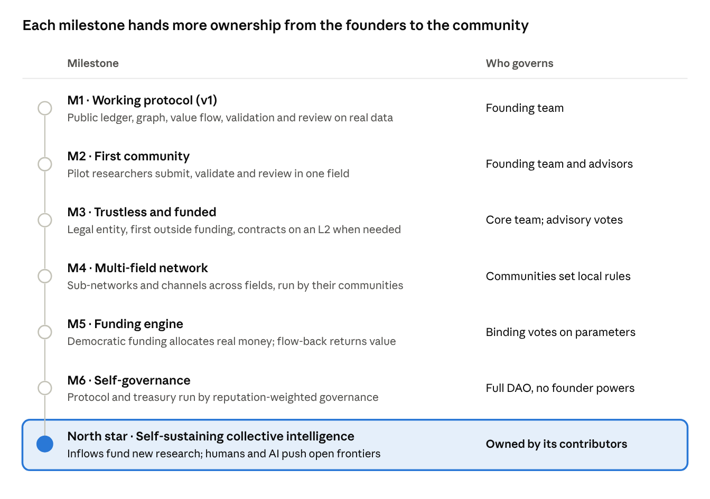
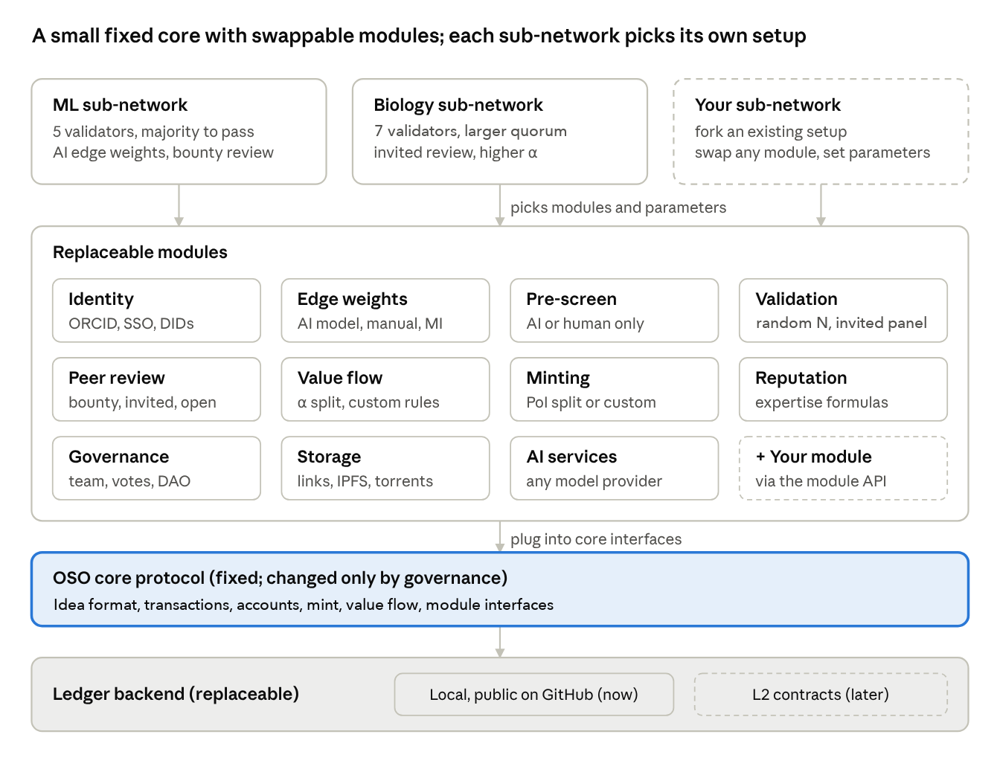
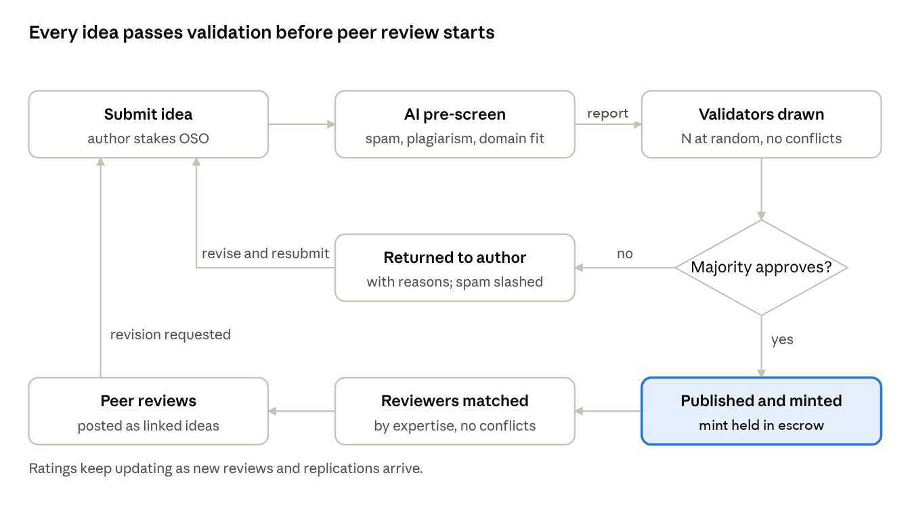
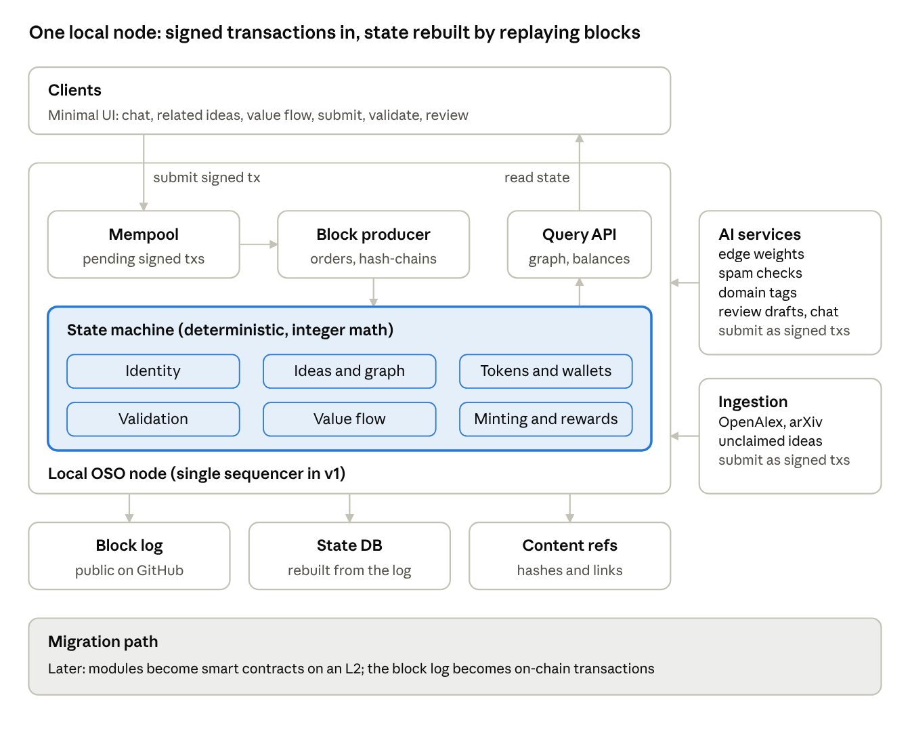
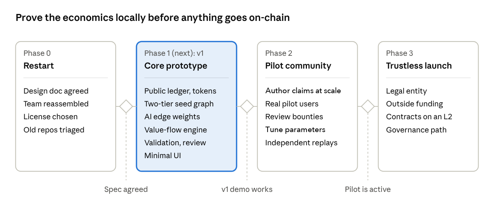

# OSO v1 Design Doc

**Author:** Gajendra Jung Katuwal (@himalayajung) · **Status:** Draft for discussion · **Last updated:** 2026-10-02

Comment through an issue or pull request in this repository.

> **TL;DR.** OSO (2017–2020) restarts in 2026 to build an open, community-owned research platform where each contribution is an *idea* in a graph and value flows back to the ideas it built on. v1 is a prototype: a simulated ledger published on GitHub, seeded from one sub-field of real literature, with minting on validation ([OIP-8](https://github.com/open-science-org/OIPs/blob/master/OIPS/oip-8.md)), AI-assisted and human-approved attribution and value flow ([OIP-14](https://github.com/open-science-org/OIPs/blob/master/OIPS/oip-14.md)), and open validation and review ([OIP-11](https://github.com/open-science-org/OIPs/blob/master/OIPS/oip-11.md)); no real money and no blockchain until milestone M3. The exact rules are in the [OIPs](https://github.com/open-science-org/OIPs) (process: [OIP-0](https://github.com/open-science-org/OIPs/blob/master/OIPS/oip-0.md)), the ideas come from the [2017 white paper](https://github.com/open-science-org/wiki/blob/master/OSO_white_paper.pdf) and [Proof of Idea](https://github.com/open-science-org/wiki/blob/master/Proof_of_Idea.pdf), and what we most need from you is answers to the [open questions](#open-questions).

## Summary

OSO v1 is a working core protocol: an idea graph with ownership, tokens and value flow-back, running on a simulated ledger whose log is public on GitHub from day one. It moves on-chain only when real money and self-custody require it. It is seeded from existing literature in two tiers: a curated slice of 50 to 100 works where value moves, inside a larger read-only import from one subfield for exploring and chat, so it is useful before anyone joins. v1 is the first of six milestones toward the north star: a self-governing, self-sustaining organization that stewards humanity's collective intelligence and keeps opening new research frontiers.

**Status:** draft for discussion. This doc restarts Open Science Organization (OSO), which was active from 2017 to 2020 and then went dormant. It consolidates the three earlier papers and the open GitHub threads into one plan, and records what has changed since: AI can now take on much of the judgment work the old design left to "the market", and open citation data eases the cold-start problem.

**What we want from readers:** challenge the scope, the token model and the ownership rules, and answer the open questions at the end.

## Vision and problem

Science is collective intelligence, and its output depends on how well value moves among researchers: money, information, credit and attention. Today that movement is centralized, opaque and run by intermediaries.

**Problems (from the 2017 and 2018 whitepapers):**

- **Funding:** a few people decide directions. Grant success rates are low, so scientists spend their time writing grants and avoid risky ideas.
- **Review:** closed, slow (a median of about 100 days from submission to acceptance, per Daniel Himmelstein's 2015 analysis of PubMed records, as cited in the 2017 whitepaper), biased, and unable to reward reproducibility.
- **Dissemination:** publishing costs $2,000 to $10,000 per paper (2015 STM Report, as cited in 2017) and subscriptions cost millions per university, while peer review is done for free.

**The OSO answer:** make the *idea* the unit of research and put the whole cycle (fund, research, review, publish) on one open, community-owned platform. It has three pillars:

1. **Open, democratic funding**, weighted by demonstrated expertise.
2. **Open, perpetual review.** Reviewers are paid, and a rating keeps changing as work is reproduced or fails to be.
3. **Value flow-back.** Value created by an idea flows back to the ideas it built on, so foundational work is rewarded in proportion to what it enabled.

**Why now (the AI era):**

- **Feasible:** LLMs can now assist with judgment work the old design could not automate: estimating how much a paper relied on each citation, filtering spam, tagging domains and helping with review.
- **Urgent:** AI will flood the literature with generated papers, so open, accountable curation becomes essential. As AI agents start producing ideas, tracing credit and provenance matters more.
- **Useful to AI:** a structured, quality-scored graph of human knowledge is itself valuable infrastructure for AI-driven research.

## North star and milestones

Our ultimate goal is for OSO to become a self-governing organization that stewards humanity's collective intelligence, sustains itself, and keeps opening new frontiers of research.

**What reaching it means**

- **Self-governing:** contributors decide the protocol rules, parameters and treasury through reputation-weighted governance. The founding team has no special powers.
- **Owns collective intelligence:** the idea graph, with its ideas, reviews, data and credit, is an open public good owned by the people who built it, and it spans all fields.
- **Self-sustaining:** value flowing in from use, funding, commercialization and fees covers operations and funds new research, without depending on any single sponsor.
- **Unlocks new frontiers:** humans and AI agents working on the graph find open problems and gaps, and the community funds and pursues them.



Each milestone is reached when its result is shown, not on a date. Control moves from the founders to the community one step at a time, and only once the step before it works. The near-term roadmap below covers Phases 0 to 3, which deliver M1 to M3.

## Goals and non-goals for v1

v1 tests accounting and incentive hypotheses on a real literature graph. It cannot show that tokens have economic value or that OSO will sustain itself; later milestones test those.

**Goals**

1. A formal spec of the Idea object, the edges between ideas, ownership, and the three token types.
2. A local simulated ledger: signed transactions, hash-chained blocks and a deterministic state machine with portable schemas and deterministic semantics, so it can later be reimplemented as smart contracts. The block log is published to a public GitHub repo from day one.
3. An idea graph seeded in two tiers: a curated slice of 50 to 100 works in one topic, whose AI-suggested edge weights are approved by a small, disclosed human panel and move value; and a larger read-only import from one subfield for discovery and chat, whose weights move no value.
4. A working value-flow engine: fund any idea and see the value propagate to its ancestors, with exact, conserved integer accounting.
5. Routing of new ideas: stake-to-submit, AI pre-screen, validation, then peer review.
6. Identity through ORCID, with an escrow for imported ideas so existing authors can claim them later.
7. A minimal UI: chat about an idea, see its related ideas and value flow, submit new ideas, and work through the validator and reviewer queues.

**Non-goals (deferred)**

- Deploying to a public blockchain or listing a token on an exchange
- DAO governance with binding on-chain votes
- Decentralized file storage (IPFS, torrents); v1 stores metadata and links, not files
- Large-scale democratic funding with real money
- Coverage of every field

## Design principles

OSO is a small fixed core with modular, replaceable parts, and every community can customize which modules it uses and how they are set up.

**Specification:** [OIP-12: Module interface and community setups](https://github.com/open-science-org/OIPs/blob/master/OIPS/oip-12.md).

1. **Modular and replaceable.** Each function sits behind a defined interface and can be swapped without touching the rest: a better edge-weight model, a new validator-selection rule, another identity provider, or the move from the local ledger to L2 contracts. The 2018–2020 history shows why. The storage layer went from IPFS to OrbitDB to libtorrent, and the protocol should not break each time a part is replaced.
2. **Customizable per community.** Sub-networks and channels choose module implementations and parameters: number of validators, pass threshold, default α, reward split, review policy. Setups are public and versioned. A community unhappy with its rules can fork the setup; the fork lists the same ideas and governs new submissions under its own rules, while existing ideas stay under the setup they were submitted to (OIP-5, OIP-12).
3. **Small fixed core.** Only the idea format, signed transactions and blocks, accounts, the mint and the value-flow waterfall, and the module interfaces are fixed (OIP-12). Changing them requires governance approval.
4. **Open by default.** Code, specs, the ledger and all votes are public.
5. **AI proposes, humans decide.** Every AI output can be accepted or overridden, and the record shows which happened.
6. **Voting weight can't be bought directly.** It comes from reputation, not token balance. This is one defense, not a guarantee: on its own it does not stop bribery, account takeover or vote trading.
7. **A blockchain only where trust requires it.** Use a public GitHub ledger first, and contracts only once real money and self-custody need them.



**How a module plugs in**

- It declares the transactions it handles, the state it owns, the events it emits and the parameters a community can set.
- Modules interact only through core events and interfaces, never by reading each other's state. That is what makes each one swappable.
- A new module or version runs alongside the old one, and each community opts in by updating its setup.
- Every module must be deterministic and replayable from the public log, so any community's results can be checked.

## Core concepts

OSO has three kinds of entity: **ideas**, the **users** who create and use them, and **tokens** that reward fair interaction between the two.

**Specification:** [OIP-8: Token structure](https://github.com/open-science-org/OIPs/blob/master/OIPS/oip-8.md), [OIP-10: Ownership and identity](https://github.com/open-science-org/OIPs/blob/master/OIPS/oip-10.md), [OIP-14: Idea attribution and value flow](https://github.com/open-science-org/OIPs/blob/master/OIPS/oip-14.md).

**Idea.** Any intellectual contribution that adds new information: a paper, dataset, code, review, hypothesis or replication. Ideas are versioned, and a review is itself an idea. Draft fields:

| Field | Meaning |
| --- | --- |
| id | Stable work ID, plus an immutable ID (content hash) per version. Status, ownership and payout settings live in separate registry state, so changing them never looks like new work. |
| title, abstract, type, domain tags | Human-readable description |
| content\_refs | Hashes and links to the files (paper, data, code) |
| owners | List of (identity, share in basis points), summing to 10,000 |
| parents | List of (idea id, weight w); see Edges |
| alpha (α) | Share of incoming value the idea keeps; the rest flows to its parents. Set by the community, not the author (an author could otherwise choose α = 1 and keep everything). |
| license | e.g. CC-BY-4.0 |
| status | One of the routing states in OIP-11, for example Submitted, Admitted (in its challenge window), Published, Returned or Removed |
| ai\_disclosure | Whether, and how, AI produced or assisted the work |

**Identity.** A key pair plus a growing set of attestations: ORCID, institutional email, peer vouches. A person or an organization can hold an identity; an AI agent cannot, and acts only through a scoped delegation from one.

**Edges and weights.** A directed edge from parent to child means the child built on the parent (idea flow). The weight w is the share of the child's intellectual debt owed to that parent. Weights sum to 1 across a child's parents. The 2018 paper defined w as normalized mutual information. v1 treats w as a judgment instead: AI suggests weights using a rubric (essential method, data dependency, background, critique), and people approve them: validators at admission for new submissions, and a disclosed human panel for the curated slice of imported papers (OIP-14). OpenAlex citation data is incomplete and has no citation context, so weights need checking. Approved weights apply to future payments only; a revision never rewrites past payouts.

**Tokens.** There are three layers, so money and voting power stay separate. The full rules for supply, minting, the payout waterfall and IDEA tokens are in OIP-8 (draft, in the OIPs repo).

| Layer | Transferable | Purpose |
| --- | --- | --- |
| OSO token | Yes | Medium of exchange: stakes, bounties, review fees, funding, treasury |
| IDEA tokens (one set per idea) | Not in v1 | The ownership shares of that idea: the only payout right on the value it retains |
| Reputation / expertise score | No (soulbound) | Voting weight in validation, review and governance; earned, never bought |

## Mechanisms

New OSO is minted when an idea is validated, as in Proof of Idea. Because AI can generate plausible papers cheaply, the validation gate does the protecting: stakes, AI pre-screening, per-identity limits and a challenge window guard the mint.

**Specification:** [OIP-8: Token structure](https://github.com/open-science-org/OIPs/blob/master/OIPS/oip-8.md) (minting, stakes, IDEA tokens), [OIP-9: Reputation and expertise](https://github.com/open-science-org/OIPs/blob/master/OIPS/oip-9.md), [OIP-11: Submission routing](https://github.com/open-science-org/OIPs/blob/master/OIPS/oip-11.md) (validation, challenges, review), [OIP-14: Idea attribution and value flow](https://github.com/open-science-org/OIPs/blob/master/OIPS/oip-14.md) (payout waterfall).

**1. Stake-to-submit.** The author stakes a small amount of OSO with each new idea. The stake is returned when the challenge window closes without a successful challenge (or when the idea is returned for a reason other than spam), and slashed if validators or a challenge find spam or plagiarism.

**2. Validation (layer 1).** AI pre-checks for spam, plagiarism, domain fit and plausible edge weights. Then N randomly selected validators (e.g. 5 to 7, drawn by a logged, reproducible procedure; see Architecture for its trust limits) vote. More than 50% approval publishes the idea into the graph. Validators are paid a fixed fee from the OSO fund for every on-time vote, whatever the outcome, plus a share of the mint when an idea is admitted. Validation is an admission check against stated criteria (provenance, required fields, duplication, spam, plagiarism, domain fit), not a scientific verdict. Validators are sanctioned only when their decision is overturned with evidence, on challenge or on the author's appeal, or for missed deadlines; owners can appeal both a rejection and a removal once. Scientific disagreement is never penalized (addresses OIP-4). If a community cannot supply enough conflict-free validators, the idea waits: quorum and conflict rules are never relaxed silently.

**3. Value flow-back.** Value v entering idea I₀ from use, funding, a bounty or a gift is split as follows:

```latex
\text{kept by } I_0 = \alpha_0 v \qquad v_j = w_{0j}\,(1-\alpha_0)\,v \quad \text{for each parent } I_j
```

Each parent then keeps αⱼ of what it receives and passes the rest upstream. Value moves only along the payout graph: approved links from a later idea to strictly older ones, so it is acyclic. Similarity, disagreement and other links move no money. Root ideas keep everything they receive, and a shared ancestor reached through two branches receives both amounts. All amounts are integers; each idea tracks its cumulative obligations, so splitting one payment into many small ones gives the same end-of-round result, and small amounts wait as recorded liabilities until they are worth settling. What an idea keeps goes to its IDEA-token holders, who are its owners: the tokens are the ownership shares (OIP-8). Exact rules are in OIP-14.

**4. Minting on validation.** When an idea passes validation, new OSO is minted and split as in Proof of Idea: 50% to the authors, 30% to the OSO fund, 15% to the cited ideas (by edge weight w, then flowing upstream by α) and 5% to the validators. The whole mint, and the author's stake, are held during a challenge window measured in blocks. They are released when the window closes, or burned and slashed if a challenge (and any appeal) shows spam or plagiarism. Only newly submitted original work mints: imported papers, metadata edits and ownership changes never do. Whether revisions, reviews and replications mint is an open question. Value that arrives later (use, funding, gifts) reaches an idea through flow-back, not new minting. Emission policy (fixed cap or adaptive) is an open question.

**5. Review (layer 2 and up).** Authors or channels post a review bounty in OSO. Reviewers claim it and submit reviews as idea objects linked to the reviewed idea. Ratings keep updating as new reviews, replications and downstream use arrive (perpetual review). Negative reviews and scientific dissent stay public alongside the idea. Failed admission and detected plagiarism are separate states.

**6. Where value comes from.** Tokens only have value if outside value flows in. The sources are grants and philanthropy routed through ideas, industry bounties, investment through IDEA tokens, commercialization revenue and platform fees. Recruiting the first real funders matters more than the token design.

**7. Bootstrap.** The first validators, their starting reputation and the first participants' submission stakes come from a disclosed, capped allocation of simulated units from the founding team. This breaks the loop where staking requires tokens and earning tokens requires staking.

## Ownership and identity

Ownership has three layers: proof of authorship, the link from a key to a real person, and ownership of the value an idea earns.

**Specification:** [OIP-10: Ownership and identity](https://github.com/open-science-org/OIPs/blob/master/OIPS/oip-10.md).

**Proof of authorship and priority.** Each idea version is hashed, signed by every owner's key, and recorded in a block with an operator-logged timestamp. In v1 this is a registration claim recorded by the operator, not independent proof of priority. It also does not prove who thought of the idea first; plagiarism checks at validation and a staked challenge process cover that gap.

**Identity (replaces the 2017 URI design).** Researchers sign in with ORCID. ORCID proves control of an ORCID account, not real-world identity, and it does not create keys. After sign-in, OSO creates a key pair and, in v1, holds it for the user. Key recovery, export, delegated signing (including for AI services) and operator access must be specified before real value is involved. Identity strengthens as attestations accumulate: ORCID, institutional email, peer vouches. New identities are rate-limited, and voting weight comes from earned reputation, which together limit Sybil attacks.

**Co-author shares.** For new submissions, owners and their shares are part of the signed idea version, and every listed owner must sign. Imported ideas are registered without owner signatures and carry no financial terms until their authors claim them. Changing the shares needs a new version signed by all current owners.

**Value ownership.** Each idea has its own wallet in the ledger. Incoming value is split by α, and what the idea keeps goes to its IDEA-token holders. Each idea has 1,000,000 IDEA units, allocated to the owners by their signed shares; changing the shares moves the units (OIP-8, OIP-10). Attribution, payout rights and intellectual-property rights are recorded as separate fields; none implies the others.

**Imported literature (unclaimed ideas).** Papers imported from OpenAlex become unclaimed nodes. Their author lists are bibliographic attribution, not payout rights, since OpenAlex and ORCID matches can be wrong. Each author gets a separate claim slot, and value accrues per slot as an identifiable liability. A matching ORCID starts a claim, but missing identifiers, disputed matches and co-author splits go through a defined adjudication process (still to be designed). Shares are never assumed equal without a stated policy. Claimable value gives existing researchers a concrete reason to join.

**AI-produced ideas.** An AI agent cannot own an idea. Ownership goes to the person or organization running the agent, and AI involvement must be disclosed. Communities may set different α or reward rules for AI-produced work.

**Legal.** A ledger record is evidence, not intellectual-property law. Every idea carries an explicit license. IDEA tokens that promise revenue may be securities and need legal review before any real money is involved.

## v1 user interface

v1 ships a minimal web UI on top of the node. Users can chat about any idea, see its related ideas and value flow, and submit new ideas. Submissions are routed through validation first, then peer review.

**Specification:** routing in [OIP-11: Submission routing](https://github.com/open-science-org/OIPs/blob/master/OIPS/oip-11.md); chat and AI assistance in [OIP-15: AI services, models and costs](https://github.com/open-science-org/OIPs/blob/master/OIPS/oip-15.md).

| Screen | What the user can do |
| --- | --- |
| Idea page | Read the idea's metadata and content links; chat with an AI assistant grounded in the idea's text and its graph neighbors; see owners, status, reviews and ratings |
| Related ideas and value flow | See parents, children and similar ideas as a graph with edge weights; see actual value flows and balances; simulate "fund this idea with X OSO" and watch the split |
| Submit | Upload or link content, add metadata, pick parents (AI suggests parents and weights), set owners and shares, stake, and track status |
| Validator queue | Assigned ideas with the AI pre-screen report; approve or reject with a reason before the deadline |
| Reviewer queue | Matched review requests; write and sign a review (AI can draft notes); recommend accept or revise |
| Profile and wallet | Identity and attestations, balances, owned ideas, reputation, unclaimed-idea claims |

**Routing of a new idea**



1. **Pre-screen.** AI checks for spam, plagiarism against the graph, domain fit and plausible edge weights, and records a report for the validators. The pre-screen never rejects an idea on its own.
2. **Validator draw.** N validators (e.g. 5) are drawn from the domain's published validator roster by a logged, reproducible procedure. Co-authors, recent collaborators and same-institution validators are excluded. A validator who misses the deadline is replaced and loses some integrity score.
3. **Validation vote.** More than 50% approval admits the idea into the graph and mints its tokens into escrow; the mint and the stake are released when the challenge window closes. Otherwise it goes back to the author with the validators' reasons, and the author may appeal once. The stake is slashed only if a majority marks the idea as spam.
4. **Peer review.** After publication, reviewers are matched by their expertise score in the idea's domain, with the same conflict rules. Each review is posted as an idea linked to the reviewed idea. A revision request creates a new version, which goes back to review.
5. **Perpetual review.** Ratings keep updating as new reviews, replications and downstream use arrive.

Chats are not recorded on the ledger. An insight from a chat can be submitted as a new idea.

## Role of AI

AI takes on judgment work the 2018 design left to "the market". Humans keep the final say: every AI output is a proposal that authors, validators or reviewers can accept or override, and the record shows which happened.

**Specification:** [OIP-15: AI services, models and costs](https://github.com/open-science-org/OIPs/blob/master/OIPS/oip-15.md); intrinsic assessments in [OIP-14: Idea attribution and value flow](https://github.com/open-science-org/OIPs/blob/master/OIPS/oip-14.md).

| Task | AI does | Human role |
| --- | --- | --- |
| Edge weights w | Suggests how much the work relied on each parent, using a rubric (essential method, data dependency, background, critique); checked against expert disagreement and stability across model versions | Author proposes or adjusts; validators approve at admission; a disclosed panel approves weights for the curated slice |
| Spam and plagiarism | Pre-screens submissions and checks similarity against the graph | Validators decide |
| Domain tagging | Places each idea in a field and estimates its similarity to domain D (the sᵢᴰ term in expertise scores) | Community can correct |
| Review assistance | Drafts structured review notes: method, reproducibility, claims vs. evidence | Reviewers write and sign the review |
| Idea search | Answers questions over the graph: lineage, gaps, related work | n/a |
| Ingestion | Turns imported papers into idea objects with metadata and estimated edges | Spot checks |

Rule: every AI output enters the ledger as a recorded input, together with the model, prompt or configuration ID, sources and evidence used, and the human decision on it. Replay reads these records and never re-runs a model or fetches live metadata. Re-running AI is a separate audit, not part of replay.

**Models and costs.** OSO does not depend on any one model. Each community pins a model, version and prompt per task, and outputs are recorded so that models can change without breaking replay. Tasks that affect payouts or admission are checked by two models from different families, preferably at least one open-weight, and disagreements go to people. Models can run through hosted APIs or be hosted locally, for example with Ollama, llama.cpp, vLLM or LM Studio; authors can require local-only processing for unpublished work.

In v1, AI compute is a real-money cost while tokens are simulated, so the founding team, grants or donated compute credits pay for it, and the budget and spending are published. In the protocol, the OSO fund pays for AI processing of submissions from its 30% share of each mint, so authors never pay a processing fee. Slashed spam stakes offset the cost spam causes. Chat has a free tier, and heavier users pay in OSO or bring their own key or model. When the AI budget for a round runs out, submissions wait; checks are never skipped.

Estimating how much one idea depends on another is still an open research problem. The AI makes attribution workable, not yet accurate; the research needed is listed in OIP-14.

## Architecture

v1 runs as one local node that behaves like a blockchain: every change is a signed transaction, blocks are hash-chained, and state is a deterministic function of the block log. This keeps development fast. Portable schemas and deterministic semantics make a later on-chain version feasible, though contracts will still need their own work on authorization, storage, gas limits, custody and cutover.

**Specification:** [OIP-13: Public ledger and migration path](https://github.com/open-science-org/OIPs/blob/master/OIPS/oip-13.md), [OIP-12: Module interface and community setups](https://github.com/open-science-org/OIPs/blob/master/OIPS/oip-12.md).



AI services and ingestion have no special access. They act under a scoped, revocable delegation from the operator's (or another organization's) identity, and submit signed transactions through the normal path, so their contributions are recorded and auditable.

**Design rules that keep migration cheap**

- **Transactions:** every state change is a transaction signed by the sender's key, with a nonce. Keys use Ethereum-style secp256k1 addresses so identities carry over unchanged. Signatures use typed data with a protocol and network domain plus per-account nonces, because typed signing alone does not prevent replay.
- **Blocks:** the local sequencer batches transactions into blocks. Each block holds the previous block's hash and a Merkle root of its transactions. Validators are selected by a logged, reproducible procedure over a published roster. In v1 the operator orders transactions and could try to bias a draw seeded by a block hash. This trust assumption is disclosed, and v1 does not claim manipulation resistance. A later version needs its own randomness design.
- **State machine:** a pure function `apply(state, tx)`. It uses integer amounts in the smallest unit (like wei), weights and shares in basis points, and no floats, clock or outside calls. Every replay gives the same result, and AI suggestions and human decisions enter as recorded inputs. Time-based rules, such as the challenge window, are measured in blocks. Module dispatch order and policy versions are part of the log.
- **Modules map to contracts:** Identity, Ideas and graph, Tokens and wallets (OSO as ERC-20, IDEA tokens per idea), Validation, Value flow, Minting and rewards.
- **Storage:** The append-only block log is the source of truth. It is published from day one to a public GitHub repo with signed commits, along with periodic state snapshots. Anyone can replay it with the open-source node and check every balance and ownership record. Signed commits authenticate changes, but GitHub admins can still force-push. The log is therefore tamper-evident relative to published checkpoints and independent mirrors, not immutable. The state database (SQLite) can be deleted and rebuilt by replaying the log. Files are not stored; ideas point to them by hash, DOI or arXiv link.
- **Value-flow cost:** transfers below a dust threshold wait as recorded liabilities and settle once they are large enough or at the end of each round. Worst-case depth and branching will be measured and capped, and settlement done in bounded steps that keep pending liabilities, before any contract version. Solidity loops that grow with stored data can exceed gas limits.
- **Migration steps:** (1) deploy the modules as contracts; (2) load a snapshot of identities, ideas, balances and escrow, checked by replaying the public log; (3) switch writes to the chain. This happens at M3, and only once outside money and self-custody require it.

**Public GitHub now, blockchain at M3.** A public repo gives transparency from day one: anyone can read every transaction, git history is hash-chained, and anyone can replay the log. A blockchain adds trustlessness, which matters only once real money and ownership are at stake.

| Need | Public GitHub ledger | Blockchain |
| --- | --- | --- |
| See and verify everything | Yes | Yes |
| Who can write | Only OSO maintainers, who could ignore a transaction | Anyone; rules decide |
| Custody of tokens | Balances are rows OSO controls | Users hold their own keys |
| Enforcing value splits | Runs because OSO runs the code | Contracts pay out without anyone's permission |
| If OSO stops | Someone must fork it and win trust | Contracts keep running |
| Platform risk | GitHub can suspend the org | No single company can |

## Attack vectors and mitigations

The main risks are spam, Sybil identities, buying influence and gaming the edge weights; each has at least one defense in v1.

| Attack | Mitigation |
| --- | --- |
| AI-generated spam papers | Stake-to-submit with slashing, AI pre-screen, per-identity submission limits, and a challenge window before any part of the mint or the stake is released |
| Sybil identities | ORCID plus attestations, rate-limited onboarding, and reputation that is earned slowly |
| Buying influence (the old "pharma buys tokens" question) | Voting uses non-transferable reputation, not token balance. This is one defense; bribery, account takeover and vote trading still need monitoring |
| Inflated edge weights (citation rings, self-citation) | AI estimate as the baseline, validator review, graph analysis for rings, and capped weight for self-citation |
| Lazy or malicious validators | Logged selection, public votes, deadlines, pay that does not depend on the outcome, and sanctions only for decisions overturned on challenge or appeal |
| Capture of a channel or sub-network (OIP-5) | Open rules and history; communities can fork a setup, list the same ideas and govern new work under their own rules |
| Plagiarism or priority theft | Similarity checks against the graph, and a staked challenge window after publication |
| Token concentration by early funders (OIP-3) | No pre-mine beyond a small, disclosed bootstrap pool; earned emission; and funding that can never buy voting weight |
| Large files overloading storage | v1 stores hashes and links only, with size limits on anything hosted |

## Related work since 2017

Several projects now cover parts of the OSO vision. Our working hypothesis, not yet checked systematically, is that none combines a weighted idea graph with recursive value flow-back. Descriptions were checked against the projects' own pages in October 2026.

| Project | What it does | Borrow / differ |
| --- | --- | --- |
| ResearchHub | Tokenized rewards for posting, reviewing and discussing papers | Borrow paid peer review; differ by rewarding downstream use, not activity |
| DeSci DAOs (e.g. VitaDAO) | Community funding of longevity research, with resulting IP held as IP-NFTs | Borrow the IP and funding structures; differ by being field-agnostic and graph-based |
| Hypercerts | On-chain certificates of impact claims, used for retroactive funding | Possible format for IDEA tokens or impact claims |
| Retroactive public-goods funding (e.g. Optimism) | Reward work after it proves useful | Possible later complement to minting on validation |
| Ethereum Attestation Service | Standard on-chain attestations | Candidate format for identity attestations after migration |
| OpenAlex, Semantic Scholar, arXiv | Open metadata and citation graphs | Seed data for the graph |
| ORCID | Researcher identifiers | Identity anchor |
| Open review (e.g. OpenReview) | Public reviews for venues | Reference for review workflows |

## Near-term roadmap (Phases 0 to 3)

Four phases, each gated by a result rather than a date. Phases 1 to 3 deliver milestones M1 to M3 of the north star. Phase 1 is v1: the local ledger, a real idea graph, value flow, validation and peer review, and the minimal UI.



Dates are not set yet. The gate criteria (for example, how many active pilot researchers count as "active") are proposed below; their exact numbers are still to be set.

| Gate | Passed when |
| --- | --- |
| Spec agreed | The open decisions on α policy, emission and mint eligibility are settled, the payout-rights choice in OIP-8 is confirmed, and the OIPs the first build needs are accepted |
| v1 demo works (M1) | Every v1 acceptance check below passes on the curated slice, and a deleted database rebuilds from the public log to an identical state hash |
| Pilot is active (M2) | A pilot group of agreed size completes submit, validate and review on their own work, and imported authors make and resolve claims |
| M3 reached | The legal entity operates, outside funding has flowed through the graph to authors and parent ideas, and every funded payout reconciles |

Gates for M4 to M6 will be set when M3 is reached.

**v1 acceptance checks**

- [ ] Debits equal credits plus escrow plus pending liabilities, in integer units.
- [ ] Supply equals genesis allocation plus minting minus burning, and transfers conserve supply.
- [ ] Owners and IDEA-token holders can never jointly claim more than the defined pool.
- [ ] Cycles, roots, shared ancestors, unresolved parents, dust and split payments each have a specified, tested outcome.
- [ ] A revision cannot duplicate work or receive repeated minting.
- [ ] Failed or replayed transactions change nothing, and a challenge cannot be used twice.
- [ ] Replaying the same log and module versions gives the same state hash, with no network calls.
- [ ] Scientific dissent is kept, and sanctions require a specified violation.

These checks cover accounting correctness only. Resistance to gaming and usefulness to researchers and funders are measured separately, and a working balance animation says nothing about either.

## Specifications (OIPs)

This doc is the overview; the exact rules are in OSO Idea Proposals (OIPs), which follow Ethereum's EIP process. All v1 OIPs are drafts. The links below work once the OIPs branch is merged into the repository.

| OIP | Title | Type / category | Status | Covers |
| --- | --- | --- | --- | --- |
| [0](https://github.com/open-science-org/OIPs/blob/master/OIPS/oip-0.md) | OIP purpose and guidelines | Meta | Living | How OIPs are written, numbered, reviewed and adopted |
| [8](https://github.com/open-science-org/OIPs/blob/master/OIPS/oip-8.md) | Token structure | Core | Draft | OSO supply, minting on validation, mint split and escrow, stakes, IDEA tokens, bootstrap |
| [9](https://github.com/open-science-org/OIPs/blob/master/OIPS/oip-9.md) | Reputation and expertise | Module | Draft | Expertise × integrity voting weight |
| [10](https://github.com/open-science-org/OIPs/blob/master/OIPS/oip-10.md) | Ownership and identity | Core | Draft | Identities, key custody, owners, imported-author claims, AI-produced work |
| [11](https://github.com/open-science-org/OIPs/blob/master/OIPS/oip-11.md) | Submission routing | Module | Draft | Pre-screen, validation, challenges, peer review |
| [12](https://github.com/open-science-org/OIPs/blob/master/OIPS/oip-12.md) | Module interface and community setups | Core | Draft | Fixed core, replaceable modules, per-community setups |
| [13](https://github.com/open-science-org/OIPs/blob/master/OIPS/oip-13.md) | Public ledger and migration path | Core | Draft | Transactions, blocks, GitHub publication, replay, migration |
| [14](https://github.com/open-science-org/OIPs/blob/master/OIPS/oip-14.md) | Idea attribution and value flow | Core | Draft | Intrinsic and extrinsic links over time, approval, payout waterfall |
| [15](https://github.com/open-science-org/OIPs/blob/master/OIPS/oip-15.md) | AI services, models and costs | Module | Draft | Model choice, local hosting, recorded outputs, who pays |
| [1](https://github.com/open-science-org/OIPs/blob/master/OIPS/oip-1.md) | IPFS integration and platform UI | Informational | Stagnant | 2017 proposal |
| [2](https://github.com/open-science-org/OIPs/blob/master/OIPS/oip-2.md) | Funding application | Meta | Stagnant | 2017 proposal |
| [3](https://github.com/open-science-org/OIPs/blob/master/OIPS/oip-3.md) | Funding OSO | Meta | Stagnant | 2018 proposal |
| [4](https://github.com/open-science-org/OIPs/blob/master/OIPS/oip-4.md) | Basic validation layer and validator merit | Informational | Stagnant | 2019 proposal |
| [5](https://github.com/open-science-org/OIPs/blob/master/OIPS/oip-5.md) | Custom validation layers | Informational | Stagnant | 2019 proposal |
| [6](https://github.com/open-science-org/OIPs/blob/master/OIPS/oip-6.md) | IdeaBoard | Informational | Stagnant | 2019 proposal |
| [7](https://github.com/open-science-org/OIPs/blob/master/OIPS/oip-7.md) | Publishing as a cascade of TCRs | Informational | Stagnant | 2019 proposal |

## Open questions

These need a decision before or during Phase 1.

- [ ] **First user:** who gets value in month one: researchers, funders or reviewers?
- [ ] **Seed field:** which sub-field seeds v1? Two candidates:
  - **Parameter-efficient fine-tuning of large language models (proposed for v1).** A tight, well-known lineage (adapters, prefix and prompt tuning, LoRA, QLoRA, DoRA and later variants) gives a natural curated slice of 80 to 100 works, inside the wider LLM-adaptation literature as the read-only import. Nearly all of it is on arXiv with full text and public code, so AI-suggested weights can be checked against expert judgment (OIP-14, Further research), and code libraries and benchmarks can be tested as ideas. The field is flooded with incremental papers while its foundations are heavily reused, which is the credit problem OSO addresses. Risk: fast-moving and conference-driven, so pilot researchers may care less about credit.
  - **Machine learning on open neuroimaging datasets (for example ABIDE for autism, ADNI for Alzheimer's).** A large literature builds on a few shared datasets and pipelines (FreeSurfer, fMRIPrep), which tests whether data and tool creators are rewarded. Many reported results have failed to replicate, which suits open, perpetual review and replication links. Funders already support data sharing and reproducibility here, which helps M3. Risk: less open full text and a slower pace, so fewer new submissions during a pilot.

  Proposal: start v1 with parameter-efficient fine-tuning, and add neuroimaging ML as the second community, which also tests per-community setups such as a different default α.
- [ ] **Emission:** how much is minted per validated idea? Keep Proof of Idea's fixed cap (10¹² OSO, reward rate 10⁻¹⁰ of the remaining supply), or let the rate adjust over time?
- [ ] **Default α:** fixed per community (now proposed), never set by authors. What default value (e.g. 0.8), and can a community change it for existing ideas?
- [ ] **Reward split:** keep Proof of Idea's 50/30/15/5 split (authors, fund, cited ideas, validators), or change it? How long should the challenge window be?
- [ ] **Governance at launch:** a core team at first, with what path and timeline to community control?
- [ ] **Legal entity:** a non-profit (as discussed in OIP-3) or a foundation, and in which country?
- [ ] **Target chain for migration:** which L2, and when do we decide?
- [ ] **License** for OSO code and specs (open since 2017, admin #1).
- [ ] **Team:** who from the original group is back, and who are we recruiting?

**Raised by the technical review (2 Oct 2026)**

- [ ] **Payout rights:** OIP-8 now specifies IDEA tokens as the ownership shares themselves (one right per idea). Confirm, or argue for a separate IDEA pool.
- [ ] **Mint eligibility:** do revisions, reviews and replications mint?
- [ ] **Claim adjudication:** who resolves disputed author matches and co-author splits for imported papers?
- [ ] **Small communities:** what happens when a community lacks conflict-free validators for a long time?
- [ ] **First task:** what can the first user complete in month one?
- [ ] **Specs to write as OIPs, each before its phase:** OIPs 8 to 15 are now drafted (see Specifications). Still to write: per-transaction schemas and canonical serialization (Phase 1); review bounties, funding transactions and control of the OSO fund (Phase 1); review ratings and how they feed reputation (Phase 1); key custody after migration and a randomness design (Phase 3); governance procedures (Meta); and the rules for enabling IDEA transfers.

## References

**Prior OSO papers**

- [OSO white paper](https://github.com/open-science-org/wiki/blob/master/OSO_white_paper.pdf) (Aug 2017): principles, funding and review model, cost of idea
- [OSO: An Idea Platform v0.3](https://github.com/open-science-org/wiki/blob/master/OSO_Idea_Platform_whitepaper.pdf) (Nov 2018): GIP, tokens, expertise and reputation, Idea-Hub
- [Proof of Idea v0.0](https://github.com/open-science-org/wiki/blob/master/Proof_of_Idea.pdf) (Sep 2018): validator consensus, minting, reward split
- [Technical design v0](https://github.com/open-science-org/OSO/blob/master/OSO_design_v0.pdf) (May 2018)

**Repos and threads**

- [GIP](https://github.com/open-science-org/GIP): idea graph spec and attack-vector questions
- [URI](https://github.com/open-science-org/URI): researcher identity proof of concept
- [idea-hub](https://github.com/open-science-org/idea-hub): the 2019 proof of concept, the [2020 stack (#24)](https://github.com/open-science-org/idea-hub/issues/24), the [REST API spec (#26)](https://github.com/open-science-org/idea-hub/issues/26), and the unmerged [Solidity contract (PR #33)](https://github.com/open-science-org/idea-hub/pull/33)
- [OIPs](https://github.com/open-science-org/OIPs): proposals 0 to 15 (see Specifications), including the original issues for [validator merit (OIP-4)](https://github.com/open-science-org/OIPs/issues/6) and [publishing as a cascade of TCRs (OIP-7)](https://github.com/open-science-org/OIPs/issues/9)
- [RR-index](https://github.com/open-science-org/RR-index): researcher impact metric
