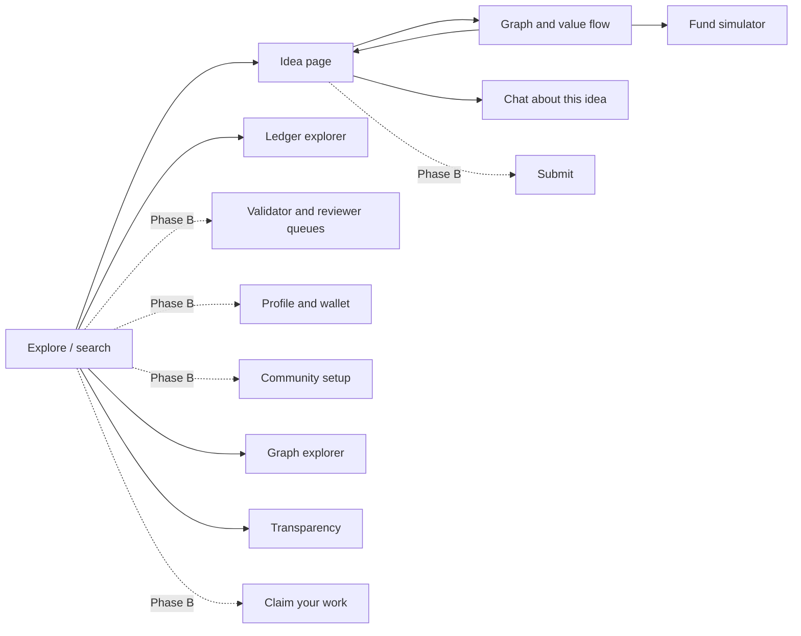
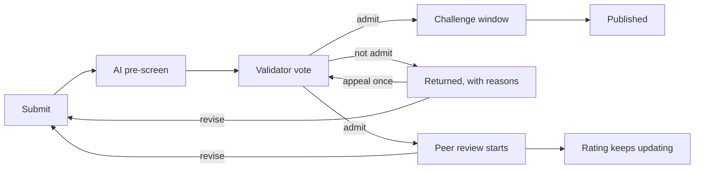
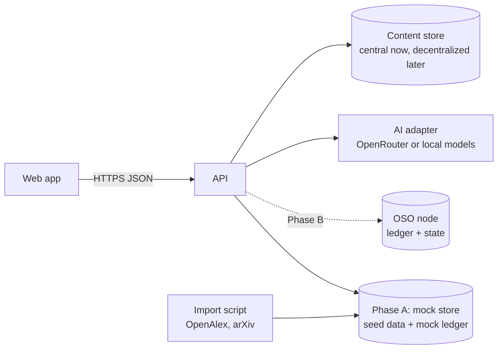

# OSO website and v1 UI: high-level design

**Author:** Gajendra Jung Katuwal (@himalayajung) · **Builders:** Abinash, Bikrant · **Status:** Draft for discussion · **Last updated:** 2026-10-06

> **TL;DR.** Start building now, without waiting for the OIPs to settle. Work in two tracks. **Track 1** grows www.oso.network from one page into a small site that explains OSO and collects sign-ups. **Track 2** builds the v1 app against a **mock API** loaded with real papers from the seed sub-field: explore ideas, read an idea, see its graph and the whole field's lineage, simulate value flow, and chat about it. Everything that depends on rules still under discussion (tokens, reputation, validation) comes from the API, never from the UI, so rule changes do not touch the front end. Sign-in, submission and the validator and reviewer queues come in Phase B, once the ledger exists; their screens are designed now (section 5.3). AI calls go through one swappable adapter: OpenRouter or local open-weight models, chosen per task by configuration (section 7). The app is **modular**: each community's setup decides which modules, steps, parameters and screens it uses, and the app reads that setup instead of hard-coding rules (section 6). Mockups of all fourteen screens: [OSO v1 UI mockups](https://claude.ai/artifact/T5bdnEa1YUdDCi8kddLZ3v). Parent docs: [design doc](design-v1.md), [OIP-16: Idea object](https://github.com/open-science-org/OIPs/blob/master/OIPS/oip-16.md).

## 1. Goals

1. Give newcomers a clear website that explains OSO, shows progress and collects interest.
2. Make the idea graph tangible before the ledger exists: anyone can browse real papers, see what each builds on, and watch value flow back.
3. Build the app shell that Phase B will plug the real ledger into, so nothing is thrown away.

**Not in this phase:** real accounts and sign-in, real submissions, validator and reviewer queues, wallets, anything on a blockchain.

## 2. What is stable enough to build on

| Area | State | How the UI treats it |
| --- | --- | --- |
| Idea object: work ID, versions, title, abstract, type, content links, attribution, license ([OIP-16](https://github.com/open-science-org/OIPs/blob/master/OIPS/oip-16.md)) | Draft, but unlikely to change much | Build directly on it |
| Graph: parents, children, citations, link types ([OIP-14](https://github.com/open-science-org/OIPs/blob/master/OIPS/oip-14.md) section 2) | Draft, stable shape | Build directly on it |
| Edge weights and the value-flow waterfall (OIP-14) | Rules may change | Show what the API returns; never compute in the UI |
| Tokens, mint split, α (OIP-8) | Numbers may change | Show API values; label them "simulated" |
| Reputation, validation, review (OIPs 9, 11, 17) | Under discussion | Phase B only; design screens, build later |
| Chat (OIP-15) | Stable enough | Build behind a feature flag, with a spending cap |

**Rule:** the UI never contains protocol logic. If a number depends on an OIP, the API computes it and the UI displays it. When an OIP changes, only the API (and later the ledger) changes.

## 3. Users and what they come for

| User | First question | Where they go |
| --- | --- | --- |
| Newcomer (researcher, engineer, funder) | What is OSO and should I care? | Website home, then the explorer |
| Researcher in the seed field | Is my work here, and what built on it? | Search, then their paper's idea page |
| Former team member or contributor | What is the plan and how can I help? | Website "Get involved", design doc, OIPs |
| Funder (later) | Where would my money go? | Value-flow simulator |

## 4. Track 1: website (www.oso.network)

A small static site, an evolution of the current page with the same look.

| Page | Content |
| --- | --- |
| Home | North star, one-paragraph explanation, a live preview (a small graph or "explore the graph" button), status, calls to action |
| How it works | Ideas, the graph, value flow-back, open review, explained with the design doc's figures in plain language |
| Progress | Milestones M1 to M6 and the current phase; short dated updates |
| Get involved | Sign-up form (name, email, role, field, how they want to help); links to OIPs, GitHub, the design doc |
| About | History 2017 to 2020, the restart, team, link to the 2017 site |

**Sign-ups.** GitHub Pages cannot store data, so the form posts to an outside service (a form tool or mailing-list service). Ask only for what we use, state how it is used, and let people unsubscribe.

**Build.** Keep it static on GitHub Pages: plain HTML/CSS or a static-site generator. Keep the current page's palette, type and dark mode as the shared visual style for the site and the app.

## 5. Track 2: the v1 app

### 5.1 Screens



| Screen | Phase A (now, mock data) | Phase B (with ledger) |
| --- | --- | --- |
| **Explore / search** | Search by title, author or keyword; browse the curated slice; filter by type and year | Filter by status and rating |
| **Idea page** | Title, authors, abstract, links (DOI, arXiv, PDF), type, license; parents and children lists with weights; "claimed / unclaimed" label for imported works | Owners, status timeline, reviews and rating, challenge info |
| **Graph and value flow** | Interactive graph of an idea's ancestors and descendants (two or three levels), edge thickness by weight; side panel with an edge's evidence (citation, AI score, rubric category) | Actual balances and flows from the ledger |
| **Fund simulator** | "Fund this idea with X OSO": animate the split down the graph using the API's result; table of who receives what | Real funding transactions |
| **Chat** | Chat grounded in the idea's abstract and its graph neighbours, with sources cited; clearly labelled AI; feature flag | Same, with per-user limits after sign-in |
| **Ledger explorer** | Blocks and transactions of the mock ledger, to show the idea of a public log | The real log on GitHub, with replay status |
| **Graph explorer** | Whole-field views: lineage over time, neighbourhood, field map, value flow, path finder, list; filters and export (section 5.5) | Same, with live data |
| **Transparency** | Ledger status, OSO fund, bootstrap pool, AI spending, who decides (section 5.7) | Same, from the real ledger |
| Submit | Designed, not built | See section 5.3 |
| My work (submission status) | Designed, not built | See section 5.3 |
| Validator queue | Designed, not built | See section 5.3 |
| Reviewer inbox and review form | Designed, not built | See section 5.3 |
| Community setup | Designed, not built | See section 6 |
| Claim your work | Designed, not built | See section 5.6 |
| Profile, notifications and integrations | Designed, not built | See section 5.7 |
| Sign-in and linked accounts | Designed, not built | See section 5.8 |

### 5.2 Key interactions

1. **Search, then idea page, then graph.** The core loop: find a paper, see what it built on and what built on it.
2. **Why this weight?** Clicking an edge shows where its weight came from: the citation, the AI's dependence score and category, and whether a person approved it. This makes OSO's attribution idea visible.
3. **Fund simulator.** Enter an amount, watch value flow up the graph level by level, then see a table of recipients. Every number comes from the API.
4. **Chat.** Ask "What does this paper build on?" or "What came after it?"; answers cite ideas in the graph with links.

### 5.3 Workflow screens (Phase B): submit, validate, review

These follow OIP-11 (submission routing) and OIP-17 (peer review). Every step, number and rule shown comes from the community's setup (section 6), so another community can show different steps without a new screen.



| Screen | Who | What it shows and does |
| --- | --- | --- |
| **Submit** | Author | Five steps: (1) content: type, main file or link, the file's fingerprint (hash) computed in the browser, optional code or data; (2) details: title, abstract, license, AI use; (3) builds on: AI-suggested parents and weights, which the author adjusts to a 100% total, with any uncited dependency the AI found shown for the author to add or explain; (4) owners and shares, with each co-owner's signature status; (5) stake and sign. A side panel explains what happens next in this community. |
| **My work** (status) | Author | A timeline for each submission: submitted, pre-screen (with the report), validation (votes and reasons, public once the vote closes), challenge window (time left, any challenges), published, and peer review (invited reviewers, submitted reviews, current rating). Shows what is held in escrow, and actions: submit a new version, or appeal if returned. |
| **Validator queue** | Drawn validators | Assigned ideas with deadlines; the AI pre-screen report (spam likelihood, closest ideas, domain fit, proposed versus suggested weights, uncited dependencies); a checklist of the admission criteria; admit or not admit, optional spam mark, and a reason; a reminder that admission is not a quality verdict and that pay does not depend on the vote. Challenges and appeals assigned to the user appear in the same queue. |
| **Reviewer inbox and review form** | Drawn reviewers, and anyone qualified | Invitations to accept or decline before a deadline; a review form with the four required questions (claims, evidence, reproducibility, what should change), an optional AI-drafted start, a score from 0 to 10 with anchors, a recommendation (endorse, revise, concerns), and AI disclosure; the current rating; and rating other reviews for usefulness. |

**Submitting for peer review** needs no separate action: under OIP-17, reviewers are invited automatically when an idea is admitted, and anyone qualified can add an open review later. If bounties for extra reviews are added (an open question in OIP-17), they get a button on the My work screen.

### 5.4 Design principles

- **Plain language first.** Say "builds on" before "parent edge"; show terms like α and IDEA tokens with a short explanation on hover.
- **Honest labels.** Mark simulated tokens as simulated, AI output as AI, imported authors as unclaimed.
- **Accessible:** keyboard navigation, readable contrast in light and dark mode, and a list view of every graph for screen readers and small screens.
- **Fast on a laptop:** the curated slice (50 to 100 works) and two or three graph levels must render smoothly; the read-only import (thousands of works) only through search.

### 5.5 Graph explorer

The neighbourhood view (screen 3) shows one idea; the graph explorer shows the whole curated slice. All views share one set of filters (link types, minimum weight, years, tier, highlight) and export options (image, JSON, GraphML for network-analysis tools, and an embeddable view).

| View | What it shows | Why it matters | Suggested library |
| --- | --- | --- | --- |
| **Lineage** | Ideas laid out left to right by year, edges showing what built on what, one idea's lineage highlighted | Matches the rule that credit flows back in time; the most intuitive view | Cytoscape.js with a layered layout (dagre or ELK) |
| **Neighbourhood** | One idea with parents and children, edge evidence and the fund simulator (screen 3) | Explains a single idea | Cytoscape.js |
| **Field map** | Every work as a point, placed by content similarity and grouped into topics | Shows the field's shape, crowded areas and gaps | Sigma.js with graphology (WebGL, thousands of points) |
| **Value flow** | Where a payment ends up after several hops, as a flow diagram | Makes flow-back visible to funders | D3 (Sankey) |
| **Path finder** | The shortest chain of "builds on" links between two ideas | Discovery and checking attribution | Any; computed by the API |
| **List** | The same data as a sortable table | Accessibility, small screens, quick scanning | Plain HTML |

The API computes layouts' inputs (graph, positions for the field map from embeddings, paths); the browser only draws them.

### 5.6 Claim your work

The hook for existing researchers (design doc, "Imported literature"). Once a user links their ORCID account (from the profile, or prompted after first sign-in), the app lists imported works whose author record matches the user's ORCID iD, each with what has built on it and the value waiting for its authors. The user selects works and signs a claim. Matches by ORCID are approved automatically after a public notice period; matches by name only go to the claims panel with evidence; co-author shares are proposed by authors and decided by the panel, never assumed equal (OIP-10 section 6). A "not my work" link reports a wrong match. Side links help find more work: BibTeX or Zotero import, the browser extension, and GitHub or Hugging Face links (section 8).

### 5.7 Profile, notifications, transparency and admin

- **Profile:** sign-in methods (Google, email and others; add or remove), identity checks (ORCID, institutional email, vouches) with the user choosing which are public, and what each check unlocks; reputation per domain and eligibility to validate or review; simulated balances; owned ideas, claims and reviews; key custody and export.
- **Notifications:** validator draws, review invitations, deadlines and changes to one's own ideas, by email, in the app and optionally Slack or Discord. Without them the validator and reviewer queues stall, so they are required for Phase B.
- **Transparency page (public, no sign-in):** ledger status and independent replays, the OSO fund's balance and flows, the bootstrap pool, AI spending by task, provider and model (OIP-15 requires publishing it), and who currently decides, with links to the decision log and setup histories.
- **Operator console (internal):** AI budgets and spending caps, the import pipeline, moderation reports, and applying approved community-setup changes.
- **Later: frontiers view.** Open questions and gaps that AI finds in the graph, for the north star of opening new research frontiers.

### 5.8 Sign-in and linked accounts

People sign in with an account they already have and add more later (OIP-10 sections 1 and 1a).

- **At launch:** Google and a one-time link by email; GitHub and ORCID as further options. No password of our own to store.
- **Future work: Sign in with Apple.** It requires a paid Apple Developer Program membership, so it waits until there is a budget and an owner for that account. Adding it later is a configuration change.
- **Linking:** from the profile, a user links more sign-in methods and attestations (ORCID, institutional email). A new method is linked only while signed in, so two accounts never create two identities by accident; signing in with an unlinked account creates a new identity, and the app offers to merge only after the user proves control of both.
- **What each step unlocks**, shown plainly in the app: any sign-in lets you submit and review openly; linking ORCID lets you claim your papers; earned reputation (plus whatever the community requires) makes you eligible to validate and to be invited as a reviewer.
- **Prompts, not walls:** after first sign-in, a short "link ORCID to find your papers" prompt; it can be skipped.
- **Privacy:** emails and account identifiers stay with the operator and never go on the ledger; the user chooses which checks are public.
- **Implementation:** use a standard sign-in protocol (OAuth 2.0 / OpenID Connect) through a hosted sign-in service or an open-source library, so providers can be added or removed by configuration. ORCID linking uses ORCID's OAuth sign-in. Keys are still created and held by the operator in v1 (OIP-10 section 2).

## 6. Modular and customizable design

OSO is a small fixed core with replaceable modules, and each community chooses its modules and parameters ([OIP-12](https://github.com/open-science-org/OIPs/blob/master/OIPS/oip-12.md)). The app mirrors this, so a community can change its rules, or a module can be replaced, without rebuilding the app.

1. **The setup drives the app.** On load, the app fetches the current community's setup (`GET /v1/communities/{id}/setup`): its module for each slot, the parameters, and its interface options. Screens read from it: the Submit side panel lists that community's steps; the validator queue shows its criteria and N; the review form shows its score scale; labels such as "5 validators" or "3 reviewers" are never typed into the UI.
2. **One UI module per protocol module.** Each protocol module (validation, review, edge weights, pre-screen, identity, AI services) has a matching front-end module that owns its screens and panels, for example `ui-validation-random-n` for the validator queue and the status timeline's validation step. A community that picks a different validation module (say, an invited panel) gets that module's UI in the same places. A small registry maps the setup's module IDs to UI modules, and an unknown module shows a plain fallback view instead of breaking.
3. **Shared building blocks.** Screens are built from shared components (idea card, graph view, timeline step, AI report card, score input, weight table) so new modules reuse them.
4. **Interface options are separate from rules.** A community may turn screens on or off (chat, fund simulator), choose which idea types it accepts, set its accent colour and edit labels and help text. These change presentation only; anything that changes who decides or what pays is a module or parameter, set through governance.
5. **Themes as design tokens.** Colours, type and spacing are tokens (CSS variables), with OSO's defaults; a community overrides a few tokens, never component code.
6. **Community switcher.** The header shows the current community and lets users switch; ideas stay global, and an idea's page shows the community it was submitted to.
7. **Forks.** The setup screen shows modules, parameters, interface options and version history, with "Propose a change" and "Fork this setup".

In Phase A there is one community and the setup comes from a fixture file, but the app already reads it, so Phase B adds communities without restructuring.

## 7. AI services and providers

AI is used in six places, each a separate task that a community configures on its own ([OIP-15](https://github.com/open-science-org/OIPs/blob/master/OIPS/oip-15.md)):

| Task | Where it appears | Phase | Needs |
| --- | --- | --- | --- |
| Chat about an idea | Idea page | A | A capable chat model; answers grounded in the idea and its neighbours, with citations |
| Edge assessment | Graph evidence panel, Submit step 3 | A (curated slice, offline), B (submissions) | Two models from different families for anything that can move value |
| Similarity and duplicate search | Search, pre-screen | A | An embedding model; no generative model |
| Pre-screen report | Validator queue, My work | B | Two models; structured output |
| Review draft notes | Review form | B | A chat model; always labelled as AI |
| Domain tagging | Ingestion, idea pages | A | A small, cheap model |

**Swappable by design.** All model calls go through one adapter in the API, never from the browser. The adapter speaks the widely supported OpenAI-style chat-completions interface, which OpenRouter, the major hosted providers and local servers (Ollama, llama.cpp, vLLM, LM Studio) offer; embeddings use the matching embeddings interface where the provider has one (check before relying on it; local servers are the safe default). Switching provider or model is a configuration change, not a code change:

```yaml
ai:
  providers:
    openrouter: { base_url: "https://openrouter.ai/api/v1", api_key_env: OPENROUTER_API_KEY }
    local:      { base_url: "http://localhost:11434/v1" }   # Ollama on a laptop or server
  tasks:
    chat:        { provider: openrouter, model: "<pinned model id>", daily_budget_usd: "<cap>" }
    edge_assess: [ { provider: openrouter, model: "<model A>" }, { provider: local, model: "<open-weight model B>" } ]
    embeddings:  { provider: local, model: "<embedding model>" }
    domain_tags: { provider: local, model: "<small model>" }
```

In Phase B these task settings move from this file into each community's setup (section 6), so a community can pin its own models. Every output that feeds a decision is recorded with its model, version and prompt ID (OIP-13, OIP-15), so swapping a model never changes past results.

**Options compared**

| Option | Pros | Cons | Use it for |
| --- | --- | --- | --- |
| **OpenRouter (one API key, many models)** | One key and one bill for models from many companies; easy to switch and to get two model families; some free, rate-limited models | Pay per use; free models are rate-limited and may change or disappear; check each model's data policy before sending unpublished work | **Recommended default for Phase A:** chat and the two-model edge assessments |
| A single provider's API directly | Often the best model quality and reliability; clear data terms | One vendor; a second key is needed for a second model family | Later, if one model is clearly best for a task |
| **Local, open-weight (Ollama, llama.cpp, LM Studio; vLLM for bulk)** | No per-call cost; unpublished work never leaves our machine; exact weights can be recorded for audits | Needs hardware (a GPU for larger models); lower quality than top hosted models for hard tasks; someone runs it | **Recommended for embeddings, domain tagging and development**, and for authors who ask for local-only processing |
| Free tiers only | No cost | Rate limits, unpredictable availability, and terms that may allow logging or training on inputs | Experiments only, never for unpublished submissions |

**Recommendation for Phase A.** Use OpenRouter for chat and edge assessments, with a small daily budget that is published, and a local Ollama server for embeddings and tagging. Developers can run everything locally at no cost by pointing every task at the local provider. API keys live only on the API server, in environment variables, never in the browser or the repository. Later, users may bring their own key or local model for heavy chat use (OIP-15 section 5).

**Costs to expect.** The curated slice is small (50 to 100 works, a few hundred edges), so assessing it once with two models is a one-off cost that is easy to bound; chat is the open-ended cost, capped by the daily budget and a per-user allowance.

## 8. Integrations and plugins

Integrations sit on the public API and webhooks, so outside contributors can build them without touching the core. Each is optional and can be switched off per community.

| Integration | What it does | Priority |
| --- | --- | --- |
| **BibTeX import** | Upload a `.bib` file in Submit; the "builds on" step is pre-filled with the cited works found in the graph | Phase A/B, high |
| **Notifications** (email, in app, Slack, Discord) | Alerts for draws, invitations, deadlines and changes | Phase B, required |
| **Zotero** | Import a library to find one's works and citations; later, two-way sync | Later |
| **Browser extension** | On an arXiv or journal page, show an OSO card: in the graph or not, what built on it, claim it | Later |
| **GitHub, Zenodo, Hugging Face** | Register code releases, datasets and models as ideas at fixed versions | Later; Hugging Face fits the seed field |
| **Embeddable badge** | "Built on by N ideas · rating 7" for lab pages and READMEs | Later |
| **Cite this idea** | A BibTeX entry with the work ID | Phase A, small |
| **Webhooks** | Events such as idea admitted or review posted, for community bots | Phase B |
| **MCP server** | Lets AI assistants query the graph (lineage, related work, ratings) | Later |
| **Python client and data dumps** | Periodic open snapshots of the graph and a client library for meta-research | Later |

Before relying on a third-party service, check its current terms and plugin or API support.

## 9. Data storage

**For now, store centrally; long term, decentralize.** Everything public is addressed by its SHA-256 hash and kept behind the storage module interface (OIP-12), so moving it to decentralized storage later changes no IDs and no code outside the module.

| Data | Where it lives in v1 | Public? | Rebuildable? |
| --- | --- | --- | --- |
| Ledger: ideas and versions, links and weights, votes, review records, balances, claims | Public GitHub repo, one file per block, signed commits, with regular state snapshots and the latest block hash copied to independent mirrors (OIP-13) | Yes | It is the source of truth |
| Current state: balances, graph, scores | Database on the OSO node, rebuilt by replaying the log | Yes, through the API | Yes |
| Uploaded files (papers, data, code archives) and text written in OSO (reviews, replies, authors' notes) | **Central content store**: an S3-compatible object-storage bucket run by the operator, files named by hash, with a size limit and a backup in a separate location (OIP-16 section 5a) | Yes once admitted; before admission only owners and drawn validators | From backups; verifiable by hash |
| Imported metadata and AI outputs | On the ledger, as recorded inputs | Yes | Yes |
| Search and similarity index | Alongside the database on the node | No | Yes |
| Accounts, emails, linked sign-ins, notification settings | Operator's private database, encrypted backups; never on the ledger | No | No |
| Signing keys held for users in v1 | Encrypted, ideally in a cloud key-management service, under the published custody policy (OIP-10) | No | No |
| Chat conversations | Not recorded; kept briefly or not at all | No | Not needed |
| Website and sign-up list | GitHub Pages; the outside form or mailing-list service | Site yes, list no | — |

**Path to decentralization**

| Stage | Content | Ledger |
| --- | --- | --- |
| Now (v1) | Central content store, backups, everything verifiable by hash | Public GitHub log with independent mirrors |
| Next | Copies of public content on decentralized storage (for example IPFS with pinning by OSO and volunteers); any copy is valid if it matches the hash | More independent mirrors and replays |
| M3 | Decentralized copies become primary; a permanent-storage network for key works; the central store becomes one copy among many | Smart contracts on a layer-2 chain (OIP-13 section 8) |

A later OIP will specify replication, pinning incentives and who pays. Private data (accounts, keys) is never put on decentralized storage.

**Before Phase B:** choose where the node, database and content store are hosted; set the file size limit; set up encrypted backups; and publish a privacy policy, since storing emails brings data-protection duties (for example for users in the EU).

## 10. Architecture



- **Web app:** a single-page app (recommendation: TypeScript with React, built with Vite, and a graph library such as Cytoscape.js or a D3 force layout). It can be hosted as static files, for example on GitHub Pages at a subdomain such as app.oso.network.
- **API:** a small service that serves the API contract below. In Phase A it reads seed data from files and computes the simulator with the OIP-14 waterfall. In Phase B it reads from the OSO node instead; the contract stays the same.
- **Import script:** pulls the seed sub-field from OpenAlex and arXiv, builds OIP-16-shaped idea records and citation links, and writes the seed files. AI edge assessments for the curated slice are added in a second step.
- **AI adapter:** one module in the API that calls whichever provider each task is configured for (section 7), enforces the budget, and records outputs.

**Repository.** A new repository for the app and API (for example `open-science-org/app`), keeping the website in `open-science-org.github.io`. The 2019 `idea-hub` code is a different stack and is best kept as history.

These are recommendations; Abinash and Bikrant should confirm or change the stack in the first week and record the choice here.

## 11. API contract

JSON over HTTPS, read-only except the simulator and chat. Field names follow OIP-16. The contract is versioned (`/v1/...`) so that the front end and back end can be built in parallel against it.

| Endpoint | Returns |
| --- | --- |
| `GET /v1/ideas?q=&type=&year=&page=` | Search results: work ID, title, authors, year, type |
| `GET /v1/ideas/{work_id}` | Idea: current version fields (OIP-16 section 4) plus registry summary (status, claimed or unclaimed, origin date) |
| `GET /v1/ideas/{work_id}/graph?depth=2` | Nodes and edges: each edge with type, weight in bps (if approved), and evidence (citation, AI score and category, approval) |
| `POST /v1/simulate/fund` `{work_id, amount}` | Per-idea amounts received, retained and passed upstream, by level |
| `POST /v1/chat` `{work_id, messages}` | Answer with cited work IDs (streamed) |
| `GET /v1/ledger/blocks?page=` and `/v1/ledger/blocks/{n}` | Mock blocks and transactions |
| `GET /v1/communities` and `/v1/communities/{id}/setup` | Communities, and one community's setup: modules, parameters, interface options, version (section 6) |
| `GET /v1/graph?view=lineage&types=&min_weight=&years=` | Nodes and edges for a whole-field view (section 5.5) |
| `GET /v1/graph/map` and `/v1/graph/path?from=&to=` | Field-map positions and clusters; the path between two ideas |
| `GET /v1/graph/export?format=json` (or `graphml`) | Graph export |
| `GET /v1/ideas/{work_id}/cite?format=bibtex` and `/badge.svg` | Citation and badge |
| `GET /v1/transparency` | Ledger status, fund, bootstrap pool, AI spending (section 5.7) |

Phase B adds sign-in (`/v1/auth/*` for each provider, `POST /v1/me/linked-accounts`, `POST /v1/me/attestations/orcid`) and, behind sign-in: `POST /v1/submissions` (with signatures), `GET /v1/me/submissions`, `GET /v1/me/validation-queue`, `POST /v1/votes`, `GET /v1/me/review-invitations`, `POST /v1/reviews`, `POST /v1/review-ratings`, `POST /v1/challenges`, `POST /v1/appeals`, `GET /v1/me/claim-matches`, `POST /v1/claims`, `GET/PUT /v1/me/notifications` and webhooks. Each maps to a ledger transaction; the API only prepares and relays signed transactions, it does not decide outcomes.

Example idea response (abridged):

```json
{
  "work_id": "sha256:<64 hex characters>",
  "version": {
    "type": "preprint",
    "title": "LoRA: Low-Rank Adaptation of Large Language Models",
    "attribution": [{"name": "Edward J. Hu", "orcid": ""}],
    "external_ids": {"arxiv": "2106.09685"},
    "license": "LicenseRef-see-source",
    "content_refs": [{"role": "main", "uri": "https://arxiv.org/abs/2106.09685", "hash": "", "media_type": "text/html"}]
  },
  "registry": {"status": "imported", "claimed": false, "origin_date": "2021-06-17", "tier": "curated"}
}
```

## 12. Seed data

- **Field:** parameter-efficient fine-tuning of large language models, as proposed in the design doc's open questions; confirm before importing.
- **Curated slice:** 50 to 100 key works, chosen with a domain expert; edges assessed by AI and reviewed by a person before they show weights.
- **Read-only import:** the wider LLM-adaptation literature from OpenAlex, searchable, with citation links but no weights.
- **Licensing:** store metadata and links only, not PDFs; respect OpenAlex and arXiv terms.

## 13. Work plan

Suggested split; Abinash and Bikrant should adjust it to their strengths.

| Week | Abinash (front end) | Bikrant (data and API) |
| --- | --- | --- |
| 1 | Website v2: pages, sign-up form, shared style and design tokens | Confirm stack; API skeleton with the contract above, fixture data and the community setup fixture |
| 2–3 | App shell (community switcher, setup loading, UI module registry), search, idea page | Import script for the seed field; search endpoint |
| 4–5 | Graph view, edge evidence panel, graph explorer (lineage view) | Graph endpoint; AI edge assessments for the curated slice (with review) |
| 6 | Fund simulator | Simulator endpoint implementing the OIP-14 waterfall, with tests from OIP-14 |
| 7 | Chat UI | AI adapter (OpenRouter and local providers), chat endpoint, spending cap |
| 8 | Field map, transparency page, polish, accessibility | Graph explorer and map endpoints; transparency endpoint; mock ledger; deploy |

**Priorities if time runs short:** search and idea page, then the lineage view, then the simulator, then chat; the field map and transparency page can slip. In Phase B, claim-your-work and notifications come first, because existing researchers and working queues depend on them.

Phase B work (submit, status, validator queue, review, claims, profile, notifications) starts once the ledger and OIPs 11 and 17 are accepted; the mockups and section 5.3 are its starting point.

**Definition of done for Phase A:** a newcomer can open the website, find a real paper in the seed field, see what it built on and what built on it, ask the chat about it, and run a funding simulation whose numbers match the OIP-14 test cases.

**Working rules:** short-lived branches with same-day pull requests; screenshots in pull requests for UI changes; no protocol logic in the front end; the API contract in this doc is updated in the same pull request as any change to it.

## 14. Working together

- **One board.** A GitHub Project with one issue per task in section 13, each with an owner, a short acceptance check and a link to the doc section or mockup. Labels: `phase-a`, `phase-b`, `blocked-by-oip`, `decision-needed`.
- **Executable contract.** Section 10 as an OpenAPI file, with a mock server and fixtures of real seed-field papers, so front end and back end work in parallel from day one.
- **Kickoff, then a light rhythm.** A one-hour kickoff through this doc, the mockups and the week-one decisions. Then a weekly written update in GitHub Discussions (done, next, blocked) and a 30-minute call for what writing cannot settle.
- **Decision log.** One short entry per decision (what, why, who, date) in the repository, linked from the transparency page.
- **Pull requests.** Same-day review; a template asking for a summary, screenshots for UI changes, and the issue link; a preview deploy for every pull request.
- **Repository basics.** README and CONTRIBUTING; one-command local setup with all AI on a local model (free); CI with lint and tests; the OIP-14 test cases as automated tests for the simulator.
- **Component gallery.** One page showing the shared building blocks (section 6, item 3), so new modules reuse them.
- **Early user feedback.** Around week 3, 20-minute sessions with three to five researchers in the seed field on the explorer and idea page.
- **Outward updates.** A dated monthly update on the website's Progress page and to the sign-up list, including which open questions we want outside input on.

## 15. Open decisions

1. Stack and repository name (section 10).
2. Domain for the app: a subdomain of oso.network or a path on the main site.
3. Sign-up service for the website, and who manages the list.
4. Which models to pin for each task, the monthly AI budget, and who pays (section 7). Who holds the OpenRouter key.
5. Who chooses the curated slice and reviews its edges.
6. Whether Phase A shows the ledger explorer at all, or waits for the real ledger.
7. Privacy for Phase B: which identity details are public on the ledger (see the OIP-10 discussion).
8. Whether validators see the authors' names before voting. The mockup hides them until the vote closes; OIP-11 does not yet say.
9. Which interface options communities may change (section 6, item 4), and who approves a change.
10. Which integrations to build first (section 8), and whether outside contributors may build them.
11. Which sign-in methods at launch, and a hosted sign-in service or our own (section 5.8). When to add Sign in with Apple, who pays for the developer membership, and who holds the account.
12. Where to host the node, database and content store; file size limit; backups; privacy policy (section 9).
